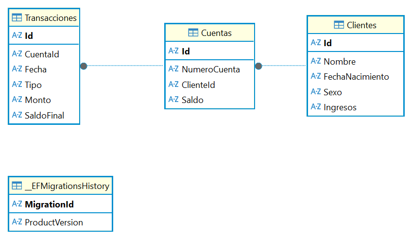

# 📘 PruebaTecnicaBLH – API de Banca Persona

API REST desarrollada en **ASP.NET Core 8** para la gestión de clientes, cuentas bancarias y transacciones financieras (depósitos, retiros e intereses).
Incluye persistencia con **Entity Framework Core**, validaciones y un modelo relacional claro.

---

# 📊 Diagrama Entidad–Relación (ER)



---

# 🚀 Características principales

* Registro y consulta de **clientes**
* Creación de **cuentas bancarias** asociadas a un cliente
* Consulta del **saldo actual**
* Registro de **depósitos**
* Registro de **retiros**
* Aplicación de **intereses al saldo**
* Historial completo de transacciones
* Servicios desacoplados por capa
* API documentada vía Swagger

---

# 🏗️ Arquitectura del Proyecto

```
📂 PruebaTecnicaBLH
 ├── Controllers
 │     ├── ClienteController.cs
 │     └── CuentaController.cs
 ├── Data
 │     ├── BancaPersonaDbContext.cs
 │     └── Migrations/
 ├── Models
 │     ├── Cliente.cs
 │     ├── Cuenta.cs
 │     └── Transaccion.cs
 ├── Services
 │     ├── ClienteService.cs
 │     ├── CuentaService.cs
 │     ├── IClienteService.cs
 │     └── ICuentaService.cs
 └── Program.cs
```

---

# 🔧 Tecnologías utilizadas

* **.NET 8 (ASP.NET Core Web API)**
* **Entity Framework Core 8**
* SQL Server
* Swagger / OpenAPI
* Inyección de Dependencias (DI)
* LINQ y programación asíncrona (async/await)

---

# ⚙️ Instalación y Ejecución

## 1️⃣ Clonar el repositorio

```bash
git clone https://github.com/jdcruz7623/PruebaTecnicaBLH.git
cd PruebaTecnicaBLH
```

## 2️⃣ Restaurar paquetes

```bash
dotnet restore
```

## 3️⃣ Configurar cadena de conexión en `appsettings.json`

```json
"ConnectionStrings": {
  "Conexion_Sqlite": "Data Source=banca_persona.db"
}
```

## 4️⃣ Aplicar migraciones

```bash
dotnet ef database update
```

## 5️⃣ Ejecutar la API

```bash
dotnet run
```

O inicia con Visual Studio 2022, Abrir el Proyecto y levantarlo para que inicie el navegador con las diferentes apis creadas y visualizadas con Swagger.

Abrir Swagger:
👉 [http://localhost:5099/swagger](http://localhost:5099/swagger)

---

👉👉👉 NOTA: Se adjunta Colección Json llamada "BLH_BancaPersona.postman_collection", que contiene las pruebas unitarias de los consumos de las diferentes apis creadas.
Esta Colección puede ser importada directamente en POSTMAN para realizar las pruebas respectivas.


# 📌 Endpoints principales

## 👤 **Clientes**

### ➤ Crear Cliente

**POST** `/api/cliente`
**Ejemplo JSON:**

```json
{
  "nombre": "Antonio Perez",
  "fechaNacimiento": "2025-12-03",
  "sexo": "Masculino",
  "ingresos": 4000
}
```

---

### ➤ Listar Todos los Clientes

**GET** `/api/cliente`

---

### ➤ Obtener Cliente por ID

**GET** `/api/cliente/{idCliente}`

---

## 💳 **Cuentas**

### ➤ Crear Cuenta

**POST** `/api/cuenta`
**Ejemplo JSON:**

```json
{
  "idCliente": "ed4da0d9-0ab6-43a4-b612-b4913898612e",
  "saldoInicial": 200
}
```

---

### ➤ Obtener Todas las Cuentas

**GET** `/api/cuenta`

---

### ➤ Saldo Actual

**GET** `/api/cuenta/saldo-actual/{numeroCuenta}`

---

### ➤ Información de Cuenta

**GET** `/api/cuenta/{numeroCuenta}`

---

### ➤ Resumen de Transacciones

**GET** `/api/cuenta/transacciones/{numeroCuenta}`

---

# 💸 Transacciones

## ➤ Depósito

**POST** `/api/cuenta/transaccion/deposito`
**JSON de ejemplo:**

```json
{
  "numeroCuenta": "639003992381528392",
  "monto": 150
}
```

---

## ➤ Retiro

**POST** `/api/cuenta/transaccion/retiro`
**JSON de ejemplo:**

```json
{
  "numeroCuenta": "639003992381528392",
  "monto": 120
}
```

---

## ➤ Aplicar Interés

**POST** `/api/cuenta/transaccion/interes`
**JSON de ejemplo:**

```json
{
  "numeroCuenta": "639003992381528392",
  "tasa": 5
}
```

---

# 🧮 Lógica de Intereses

El método aplica interés basado en porcentaje:

```csharp
decimal interes = cuenta.Saldo * (tasaInteresPorcentaje / 100);
cuenta.Saldo += interes;
```

Se registra como una transacción de tipo **"Interes"**.

---

# 🧑‍💻 Autor

**Josue Cruz**
GitHub: [@jdcruz7623](https://github.com/jdcruz7623)

---

# ⭐ Contribuciones

1. Fork al repositorio
2. Crear rama: `feature/nueva-funcionalidad`
3. Commit
4. Push
5. Abrir Pull Request

---

# 📄 Licencia

MIT — Libre para uso y modificación.

